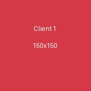
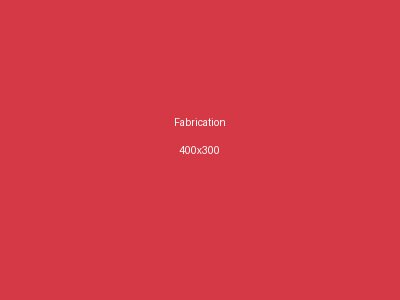
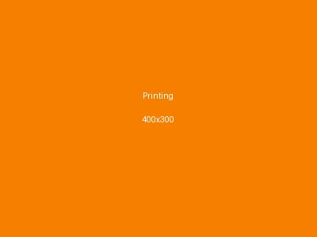
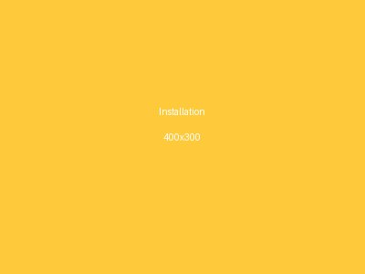
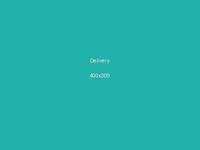

# 📸 IMAGE ASSET SETUP GUIDE

## Directory Structure

Your images are organized in the following structure:

```
MANFOREST/
├── images/
│   ├── logo.png                          ← ADD: Logo (1 file)
│   ├── portfolio/
│   │   ├── project-1.jpg                 ← ADD: Portfolio projects (12+ files)
│   │   ├── project-2.jpg
│   │   └── ...
│   ├── clients/
│   │   ├── client-testimonial-1.jpg      ← ADD: Client photos (10+ files)
│   │   ├── client-testimonial-2.jpg
│   │   └── ...
│   ├── services/
│   │   ├── fabrication.jpg               ← ADD: Service category images (4 files)
│   │   ├── printing.jpg
│   │   ├── installation.jpg
│   │   └── delivery.jpg
│   └── types/
│       ├── signage-type-1.jpg            ← ADD: Signage types (6+ files)
│       ├── signage-type-2.jpg
│       └── ...
├── index.html
├── css/
└── js/
```

---

## 1. LOGO (CRITICAL - Must Add First!)

### Logo File
- **Location:** `images/logo.png`
- **Filename:** Must be named exactly `logo.png`
- **Format:** PNG with transparent background
- **Recommended Size:** 300x100px or 400x130px
- **Display Height:** Will show at 55px on website
- **Quality:** High resolution (300+ DPI is ideal)

### Where Logo Appears
- Navigation bar (all 16 pages)
- Footer (all 16 pages)
- Login/Register pages (centered)
- 404 error page

### Setup Instructions
1. Get your Manforest Graphics logo image
2. Crop/resize to appropriate dimensions (transparent background)
3. Save as PNG format
4. Place directly in `images/` folder as `logo.png`
5. Open any page in browser - logo should appear in top-left navigation

**Expected Result:**
```
Logo shown at 55px height with semi-transparent white background
Scales smoothly to fit any screen size
Hover effect: Slight scale-up animation
```

---

## 2. PORTFOLIO IMAGES

### Usage
- Portfolio page (portfolio.html) displays your past projects/work
- Filtered by category: Wedding Signage, Business Signs, etc.

### File Requirements
- **Location:** `images/portfolio/`
- **Format:** JPG or PNG
- **Recommended Size:** 300x200px to 600x400px
- **Quantity:** At least 12 images (2-3 per category)
- **Quality:** Clear, well-lit photos of completed signage projects

### Categories to Cover
- Wedding Signage
- Business Signs
- Outdoor Signage
- Indoor Displays
- Vehicle Wraps
- Digital Displays

### File Naming Examples
```
images/portfolio/
├── wedding-signage-1.jpg
├── wedding-signage-2.jpg
├── business-signs-1.jpg
├── business-signs-2.jpg
├── outdoor-signage-1.jpg
├── outdoor-signage-2.jpg
├── vehicle-wraps-1.jpg
├── digital-displays-1.jpg
└── ...
```

### How They're Used
Portfolio page has HTML like:
```html

```

The JavaScript filters these by category for user interaction.

---

## 3. CLIENT TESTIMONIAL PHOTOS

### Usage
- Testimonials page (testimonials.html) shows client reviews with photos
- Each testimonial includes customer name, quote, and profile photo

### File Requirements
- **Location:** `images/clients/`
- **Format:** JPG or PNG
- **Recommended Size:** 100x100px (square for profile circles)
- **Quantity:** 10+ client photos
- **Quality:** Clear headshots or professional photos
- **Note:** Can use placeholder photos initially

### File Naming Examples
```
images/clients/
├── client-1.jpg
├── client-2.jpg
├── client-3.jpg
├── client-4.jpg
├── client-5.jpg
├── ...
└── client-10.jpg
```

### How They're Used
Testimonials section uses:
```html

```

Photos display in circular profile sections next to quotes.

---

## 4. SERVICE CATEGORY IMAGES

### Usage
- Services page (services.html) shows the 4 main service categories
- Each service has an icon/image and description

### Service Categories & Files

| Service | File | Size | Description |
|---------|------|------|-------------|
| Signage Fabrication | `images/services/fabrication.jpg` | 400x300px | Manufacturing process or finished signage frame |
| Printing Services | `images/services/printing.jpg` | 400x300px | Printing equipment or printed materials |
| Installation Services | `images/services/installation.jpg` | 400x300px | Installation team or completed installation |
| Delivery Services | `images/services/delivery.jpg` | 400x300px | Delivery vehicle or service photo |

### File Requirements
- **Location:** `images/services/`
- **Filenames:** Must match exactly (fabrication.jpg, printing.jpg, installation.jpg, delivery.jpg)
- **Format:** JPG or PNG
- **Size:** 400x300px minimum
- **Quality:** Professional, well-lit images

### How They're Used
Service cards use:
```html

```

Each service card shows image, title, description, and "Learn More" button.

---

## 5. SIGNAGE TYPES IMAGES

### Usage
- Service Details page (service-details.html) shows different signage types
- Portfolio page filters by these categories

### Common Signage Types to Showcase

```
images/types/
├── wedding-signage.jpg          (Wedding signs, decorative)
├── business-signs.jpg            (Store fronts, office signs)
├── outdoor-signage.jpg           (Billboard, outdoor displays)
├── indoor-displays.jpg           (Interior signage, directories)
├── vehicle-wraps.jpg             (Car wraps, van graphics)
├── digital-displays.jpg          (LED screens, digital boards)
├── event-signage.jpg             (Banners, event decorations)
└── custom-signage.jpg            (Bespoke/custom projects)
```

### File Requirements
- **Location:** `images/types/`
- **Format:** JPG or PNG
- **Recommended Size:** 500x400px
- **Quantity:** At least 6-8 images
- **Quality:** Clear portfolio-quality photos

### How They're Used
Portfolio filtering and category displays:
```html

```

---

## Implementation Order

### Step 1: LOGO (Must do first)
```bash
1. Prepare Manforest Graphics logo with transparent background
2. Save as images/logo.png
3. Test: Open index.html - logo should appear in top-left
```

### Step 2: SERVICE IMAGES (Easy, required for services page)
```bash
1. Get 4 images (fabrication, printing, installation, delivery)
2. Resize to 400x300px
3. Save with exact filenames in images/services/
4. Test: Open services.html - images should display
```

### Step 3: PORTFOLIO IMAGES (Content for portfolio page)
```bash
1. Collect 12+ project/work photos
2. Resize to 300x200px or 600x400px
3. Save with descriptive names in images/portfolio/
4. Update portfolio.html with correct filenames if needed
5. Test: Open portfolio.html - images should display with filter
```

### Step 4: CLIENT PHOTOS (For testimonials page)
```bash
1. Get 10+ client/profile photos
2. Resize to 100x100px (square)
3. Save in images/clients/
4. Update testimonials.html filenames if needed
5. Test: Open testimonials.html - photos in circles
```

---

## Quick Start with Placeholder Images

If you don't have images yet, you can use placeholder services temporarily:

### Using Placeholder Images

Visit these services to generate placeholder images:

1. **Picsum.photos** - Random photos
   ```html
   
   ```

2. **Lorem Picsum** - Customizable size
   ```html
   
   ```

3. **For testing colors:**
   ```html
   <!-- Red placeholder (matches brand) -->
   
   
   
   ```

---

## Image Optimization Tips

### File Size Management
```bash
# Recommended file sizes (after compression):
Logo: 50-100 KB
Portfolio images: 100-300 KB each
Client photos: 50-100 KB
Service images: 100-200 KB
```

### Format Recommendations
- **JPG:** Use for photographs (portfolio, client photos, service images)
- **PNG:** Use for logo and graphics with transparency
- **WebP:** Alternative modern format (if browser support desired)

### Compression Tools
- **TinyPNG/TinyJPG:** Compress images online
- **ImageOptim (Mac):** Batch compression
- **ImageMagick:** Convert and batch process commands:
  ```bash
  convert image.jpg -resize 600x400 -quality 85 image-optimized.jpg
  ```

---

## Testing Images

### How to Test Images Display Correctly

1. **Open in browser locally:**
   ```bash
   cd /Users/cailiegh/Documents/MANFOREST
   python3 -m http.server 8000
   # Visit http://localhost:8000
   ```

2. **Check each page:**
   - [ ] index.html - Logo in navbar
   - [ ] services.html - 4 service images display
   - [ ] portfolio.html - Portfolio images display with filter
   - [ ] testimonials.html - Client photos in circles
   - [ ] All pages - Logo appears consistently

3. **Mobile Test:**
   - [ ] Images scale responsively
   - [ ] No broken image icons (🖼️)
   - [ ] Images load quickly

---

## Troubleshooting

### Issue: Logo not showing
- ✅ Check filename is exactly `logo.png` (lowercase)
- ✅ File is in `images/` folder (not `assets/images/`)
- ✅ File format is PNG (not JPG)
- ✅ Path in HTML is `src="images/logo.png"`

### Issue: Portfolio images not showing
- ✅ Files are in `images/portfolio/` folder
- ✅ Filenames in HTML match actual filenames exactly
- ✅ No spaces or special characters in filenames
- ✅ Check browser console for 404 errors

### Issue: Service images not showing
- ✅ Files are in `images/services/` folder
- ✅ Exact filenames: fabrication.jpg, printing.jpg, installation.jpg, delivery.jpg
- ✅ File format is JPG or PNG

### Issue: Broken image icon (🖼️ appears)
- ✅ Filename path is incorrect
- ✅ File doesn't exist in specified folder
- ✅ Check spelling and capitalization exactly

---

## HTML References for Images

All pages already reference images with correct paths:

```html
<!-- Logo (all pages) -->


<!-- Service images (services.html) -->





<!-- Portfolio images (portfolio.html) -->


<!-- Client photos (testimonials.html) -->

```

---

## Summary Checklist

| Asset Type | Min Files | Location | Status |
|-----------|-----------|----------|--------|
| Logo | 1 | images/logo.png | 🔴 TODO |
| Service Images | 4 | images/services/ | 🔴 TODO |
| Portfolio | 12+ | images/portfolio/ | 🔴 TODO |
| Client Photos | 10+ | images/clients/ | 🔴 TODO |
| Signage Types | 6+ | images/types/ | 🔴 TODO |

---

**Once all images are added, your Manforest Graphics website will be complete and professional!** 🎨✨
